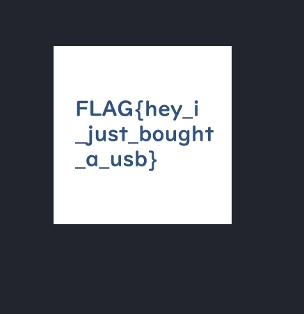
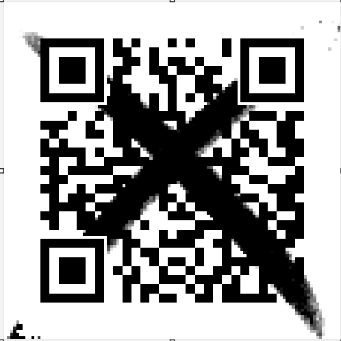
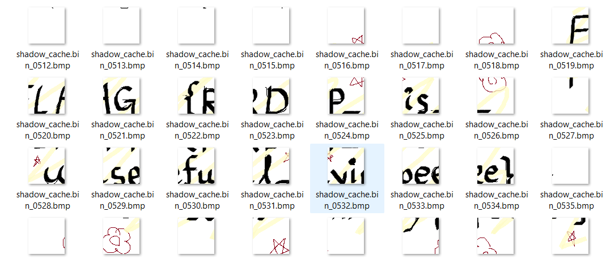

#  CTF Forensics Write-up Report

**Người thực hiện:** [Tên của bạn]  
**Ngày báo cáo:** 14/04/2026  
**Tổng số thử thách:** 06

---

##  Challenge 1: micro_drive
- **Level:** Beginner
- **Decription:** This storage device is tiny, but it still hides something interesting.


### 1. Phân tích (Analysis)
Khi dùng strings để đọc file và lọc bằng grep thì ta phát hiện có flag được giấu bên trong file iso này 
```
┌──(kali㉿Fintan)-[/mnt/hgfs/share/micro_drive/micro_drive]
└─$ strings micro_drive.iso | grep FLAG
FLAG.PNG;1
```                                                                                

### 2. Quá trình thực hiện
Sử dụng binwalk và 7z để giải nén những file ẩn bên trong 
```
┌──(kali㉿Fintan)-[/mnt/hgfs/share/micro_drive/micro_drive]
└─$ binwalk micro_drive.iso   

DECIMAL       HEXADECIMAL     DESCRIPTION
--------------------------------------------------------------------------------
0             0x0             ISO 9660 Primary Volume,
```
Binwalk không có kết quả, 7z giải nén ra thì ta được một file ảnh với flag bên trong 
### 3. Kết quả

---

##  Challenge 2: qr_fragments
- **Level:** Beginner
- **Mô tả:** Mã QR không còn nguyên vẹn, nhưng các mảnh vỡ có thể tiết lộ thông điệp.

### 1. Phân tích (Analysis)
* **Dấu hiệu:** Mã QR bị hỏng vật lý (mất góc, bị gạch xóa). Cần khôi phục cấu trúc định vị để máy quét nhận diện.
* **Công cụ:** `Microsoft vẽ `.

### 2. Quá trình thực hiện
1.  Phục hồi 3 **Finder Patterns** (hình vuông lớn) tại các góc: Trên-Trái, Trên-Phải, Dưới-Trái. Đây là điều kiện tiên quyết để máy quét xác định tọa độ.
2.  Sử dụng công cụ **QRazyBox**, tạo một lưới (Grid) mới và chấm lại các điểm đen/trắng dựa trên các mảnh vỡ (fragments).
3.  Tận dụng cơ chế sửa lỗi **Reed-Solomon** của mã QR để giải mã phần dữ liệu bị mất dưới vệt đen.

### 3. Kết quả
* **Nội dung decoded:** .
Flag: FLAG{How_scan_dalous}
---

##  Challenge 3: late_night_live
- **Level:** Easy
- **Mô tả:** Một luồng livestream chứa đựng thứ gì đó đáng xem. Định dạng H.264.

### 1. Phân tích (Analysis)
* **Dấu hiệu:** Gợi ý về việc "quan sát kỹ" và "H.264". Flag có thể ẩn trong một frame hình ảnh hoặc dữ liệu phụ trợ của video.
* **Công cụ:** `VLC Player`, `FFmpeg`, `Exiftool`.

### 2. Quá trình thực hiện
1.  Sử dụng `exiftool` kiểm tra metadata, có thể flag nằm trong phần Comment hoặc Description của video.
2.  Dùng `ffmpeg -i video.mp4 -vf "select=inframes" frames_%04d.png` để trích xuất toàn bộ frame.
3.  Duyệt nhanh qua các frame hoặc sử dụng lệnh `grep` nếu flag ẩn trong text layer.
4.  Kiểm tra các luồng (streams) khác như phụ đề ẩn bằng `ffprobe`.

### 3. Kết quả
* **Flag:** `FLAG{...}`

---

##  Challenge 4: shadow_cache
- **Level:** Normal
- **Mô tả:** Một máy trạm hoạt động lạ, điều tra viên thu được file cache.

### 1. Phân tích (Analysis)
* **Dấu hiệu:** "Workstation", "Cache file". Trong Windows Forensics, đây thường là RDP Cache (`bcache*.bmc`) lưu lại các mảnh màn hình khi điều khiển từ xa.
* **Công cụ:** `bmc-tools.py từ git: https://github.com/ANSSI-FR/bmc-tools/blob/master/bmc-tools.py`.

### 2. Quá trình thực hiện
1.  Xác định loại file cache (ví dụ: `.bin` hoặc `.bmc`).
2.  Sử dụng công cụ chuyên dụng để trích xuất các mảnh ảnh (tiles) từ cache.
3. Chuyển chế độ xem thành Large icons hoặc Extra large icons (Vào tab View trên thanh ribbon -> Chọn Large icons).
Thu nhỏ cửa sổ thư mục lại.
Đưa chuột vào cạnh phải của cửa sổ thư mục, kéo từ từ để mở rộng/thu hẹp chiều ngang đến khi flag hiện rõ.

### 3. Kết quả
* **Flag:** `FLAG{RDP_is_useful_yipeee}`

---

##  Challenge 5: miniature_view
- **Level:** Normal
- **Mô tả:** Mọi thứ dễ bị bỏ qua khi chúng bị thu nhỏ lại. Hãy nhìn kỹ vào bức ảnh tí hon này.

### 1. Phân tích (Analysis)
* **Dấu hiệu:** "Miniature", "Reduced". Có khả năng flag nằm trong **Thumbnail** (ảnh thu nhỏ) của file gốc hoặc sử dụng kỹ thuật giấu tin LSB.
* **Công cụ:** `StegSolve`, `Exiftool`, `Strings`.

### 2. Quá trình thực hiện
1.  Kiểm tra metadata bằng `exiftool`. Đôi khi Thumbnail lưu trong metadata là một ảnh hoàn toàn khác với ảnh lớn.
2.  Sử dụng `strings -n 10` để xem có chuỗi dữ liệu nào ẩn ở cuối file (sau ký tự kết thúc ảnh).
3.  Dùng **StegSolve** duyệt qua các Bit Planes. Kiểm tra `Random Color Map` để tìm các điểm ảnh bất thường ở kích thước cực nhỏ.

### 3. Kết quả
* **Flag:** `FLAG{...}`

---

##  Challenge 6: dumped_intrusion
- **Level:** Hard
- **Mô tả:** Memory dump (2GB). Cần tìm flag bắt đầu bằng `FLAG{D`. Tránh bẫy `FLAG{H`.

### 1. Phân tích (Analysis)
* **Dấu hiệu:** Phân tích bộ nhớ (Memory Forensics). Cần tìm dấu vết xâm nhập.
* **Công cụ:** `Volatility 3`.

### 2. Quá trình thực hiện
1.  **Xác định Profile:** `python3 vol.py -f memory.dmp windows.info`.
2.  **Kiểm tra tiến trình:** `windows.pslist` để tìm tiến trình lạ, hoặc `windows.cmdline` để xem các lệnh đã thực thi.
3.  **Quét file:** `windows.filescan | grep -E "flag|secret|document"`.
4.  **Phân tích bẫy:** Sử dụng `strings memory.dmp | grep "FLAG{D"` để lọc thẳng flag đúng, loại bỏ decoy `FLAG{H`.
5.  **Dump tiến trình:** Nếu flag nằm trong bộ nhớ của một app (như Notepad), thực hiện `windows.memmap --pid <PID> --dump`.

### 3. Kết quả
* **Flag:** `FLAG{D...}`

---

## 📝 Tổng kết bài học
- Forensics yêu cầu sự kiên nhẫn và kỹ năng sử dụng công cụ đa dạng.
- Luôn kiểm tra Metadata và các tệp tin đã xóa đầu tiên.
- Đối với các bài Hard (Memory Dump), việc lọc nhiễu và bẫy (decoy) là quan trọng nhất.