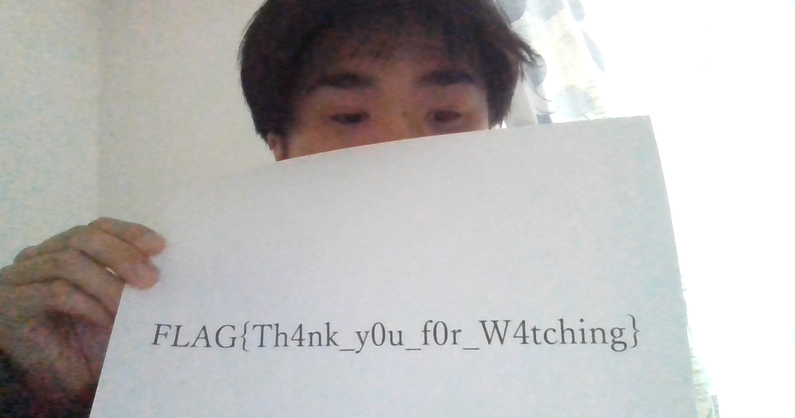
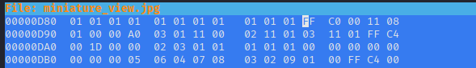

#  CTF Forensics Write-up Report

**Người thực hiện:** [Tên của bạn]  
**Ngày báo cáo:** 14/04/2026  
**Tổng số thử thách:** 06

---

##  Challenge 1: micro_drive
- **Level:** Beginner
- **Decription:** This storage device is tiny, but it still hides something interesting.


### 1. Phân tích (Analysis)
Khi dùng strings để đọc file và lọc bằng grep thì ta phát hiện có flag được giấu bên trong file iso này 
```
┌──(kali㉿Fintan)-[/mnt/hgfs/share/micro_drive/micro_drive]
└─$ strings micro_drive.iso | grep FLAG
FLAG.PNG;1
```                                                                                

### 2. Quá trình thực hiện
Sử dụng binwalk và 7z để giải nén những file ẩn bên trong 
```
┌──(kali㉿Fintan)-[/mnt/hgfs/share/micro_drive/micro_drive]
└─$ binwalk micro_drive.iso   

DECIMAL       HEXADECIMAL     DESCRIPTION
--------------------------------------------------------------------------------
0             0x0             ISO 9660 Primary Volume,
```
Binwalk không có kết quả, 7z giải nén ra thì ta được một file ảnh với flag bên trong 
### 3. Kết quả

---

##  Challenge 2: qr_fragments
- **Level:** Beginner
- **Mô tả:** Mã QR không còn nguyên vẹn, nhưng các mảnh vỡ có thể tiết lộ thông điệp.

### 1. Phân tích (Analysis)
* **Dấu hiệu:** Mã QR bị hỏng vật lý (mất góc, bị gạch xóa). Cần khôi phục cấu trúc định vị để máy quét nhận diện.
* **Công cụ:** `Microsoft vẽ `.

### 2. Quá trình thực hiện
1.  Phục hồi 3 **Finder Patterns** (hình vuông lớn) tại các góc: Trên-Trái, Trên-Phải, Dưới-Trái. Đây là điều kiện tiên quyết để máy quét xác định tọa độ.
2.  Sử dụng công cụ **QRazyBox**, tạo một lưới (Grid) mới và chấm lại các điểm đen/trắng dựa trên các mảnh vỡ (fragments).
3.  Tận dụng cơ chế sửa lỗi **Reed-Solomon** của mã QR để giải mã phần dữ liệu bị mất dưới vệt đen.

### 3. Kết quả
* **Nội dung decoded:** .
Flag: FLAG{How_scan_dalous}
---

##  Challenge 3: late_night_live
- **Level:** Easy
- **Decription:**  I did not get famous overnight, but one of my streams still holds something worth watching. Tune in carefully and see what was left behind.

### 1. Phân tích (Analysis)
khi xem file pcap ta nhận thấy rằng có rất nhiều gói tin RTP, sau khi tìm hiểu thì gói tin RTP là giao thức dùng để truyền tải video, ta sẽ ghép tất cả các luồng này lại thành 1 video hoàn chỉnh 
### 2. Quá trình thực hiện
Viết code python để trích xuất nó thành file .h254 sau đó dùng ffmpeg để chuyển nó về file mp4
```
import scapy.all as scapy

pcap_file = "file.pcap" # Đổi tên cho đúng file của bạn
output_file = "fixed_video.h264"

packets = scapy.rdpcap(pcap_file)
rtp_packets = []

print("Đang thu thập và sắp xếp gói tin...")

for pkt in packets:
    if pkt.haslayer(scapy.UDP) and len(pkt[scapy.UDP].payload) >= 12:
        payload = bytes(pkt[scapy.UDP].payload)
        # Lấy Sequence Number từ RTP Header (byte thứ 2 và 3)
        seq_num = int.from_bytes(payload[2:4], byteorder='big')
        rtp_packets.append((seq_num, payload[12:]))

# Sắp xếp theo Sequence Number
rtp_packets.sort(key=lambda x: x[0])

print(f"Đã tìm thấy {len(rtp_packets)} gói tin RTP. Đang ghép...")

with open(output_file, "wb") as f:
    for seq, payload in rtp_packets:
        if not payload: continue
        
        nal_type = payload[0] & 0x1F
        
        if 1 <= nal_type <= 23:
            f.write(b"\x00\x00\x00\x01" + payload)
        elif nal_type == 28: # FU-A (Gói bị chia nhỏ)
            fu_header = payload[1]
            if fu_header & 0x80: # Start bit
                reconstructed_nal_header = bytes([(payload[0] & 0xE0) | (fu_header & 0x1F)])
                f.write(b"\x00\x00\x00\x01" + reconstructed_nal_header + payload[2:])
            else:
                f.write(payload[2:])

print(f"Hoàn thành! File đã lưu tại: {output_file}")
```
```
┌──(kali㉿Fintan)-[/mnt/…/nam3/ki2/forencis/Baocaomarddown]
└─$ ffmpeg -f h264 -i fixed_video.h264 -vcodec copy output.mp4
```

### 3. Kết quả



---

##  Challenge 4: shadow_cache
- **Level:** Normal
- **Mô tả:** Một máy trạm hoạt động lạ, điều tra viên thu được file cache.

### 1. Phân tích (Analysis)
* **Dấu hiệu:** "Workstation", "Cache file". Trong Windows Forensics, đây thường là RDP Cache (`bcache*.bmc`) lưu lại các mảnh màn hình khi điều khiển từ xa.
* **Công cụ:** `bmc-tools.py từ git: https://github.com/ANSSI-FR/bmc-tools/blob/master/bmc-tools.py`.

### 2. Quá trình thực hiện
1.  Xác định loại file cache (ví dụ: `.bin` hoặc `.bmc`).
2.  Sử dụng công cụ chuyên dụng để trích xuất các mảnh ảnh (tiles) từ cache.
3. Chuyển chế độ xem thành Large icons hoặc Extra large icons (Vào tab View trên thanh ribbon -> Chọn Large icons).
Thu nhỏ cửa sổ thư mục lại.
Đưa chuột vào cạnh phải của cửa sổ thư mục, kéo từ từ để mở rộng/thu hẹp chiều ngang đến khi flag hiện rõ.

### 3. Kết quả
* **Flag:** `FLAG{RDP_is_useful_yipeee}`

---

##  Challenge 5: miniature_view
- **Level:** Normal
- **Decription:** Some things are easy to miss when they are reduced to almost nothing. Look closely at this tiny image and see whether its small size is hiding a bigger secret.

### 1. Phân tích (Analysis)
Vì đây là một ảnh rất nhỏ ta sẽ xem xét nó gồm bao nhiêu data
```
└─$ identify -verbose miniature_view.jpg | grep Geometry 
  Geometry: 10x10+0+0
identify: Corrupt JPEG data: 41234 extraneous bytes before marker 0xd9 `miniature_view.jpg' @ warning/jpeg.c/JPEGWarningHandler/433.
```                     
vì chỉ có 10x10 mà tận 41234  byte nên ta sẽ thử phóng to ảnh lên bằng cách điều chỉnh giá trị chiều dài và chiều rộng của bức ảnh 
### 2. Quá trình thực hiện



thay đổi tại vị trí D90 thành 01 00 00 A0 đây là vị trí chiều dài và chiều rộng của bức ảnh 
### 3. Kết quả


---

##  Challenge 6: dumped_intrusion
- **Level:** Hard
- **Mô tả:** Memory dump (2GB). Cần tìm flag bắt đầu bằng `FLAG{D`. Tránh bẫy `FLAG{H`.

### 1. Phân tích (Analysis)
* **Dấu hiệu:** Phân tích bộ nhớ (Memory Forensics). Cần tìm dấu vết xâm nhập.
* **Công cụ:** `Volatility 3`.

### 2. Quá trình thực hiện
1.  **Xác định Profile:** `python3 vol.py -f memory.dmp windows.info`.
2.  **Kiểm tra tiến trình:** `windows.pslist` để tìm tiến trình lạ, hoặc `windows.cmdline` để xem các lệnh đã thực thi.
3.  **Quét file:** `windows.filescan | grep -E "flag|secret|document"`.
4.  **Phân tích bẫy:** Sử dụng `strings memory.dmp | grep "FLAG{D"` để lọc thẳng flag đúng, loại bỏ decoy `FLAG{H`.
5.  **Dump tiến trình:** Nếu flag nằm trong bộ nhớ của một app (như Notepad), thực hiện `windows.memmap --pid <PID> --dump`.

### 3. Kết quả
* **Flag:** `FLAG{D...}`

---

## 📝 Tổng kết bài học
- Forensics yêu cầu sự kiên nhẫn và kỹ năng sử dụng công cụ đa dạng.
- Luôn kiểm tra Metadata và các tệp tin đã xóa đầu tiên.
- Đối với các bài Hard (Memory Dump), việc lọc nhiễu và bẫy (decoy) là quan trọng nhất.